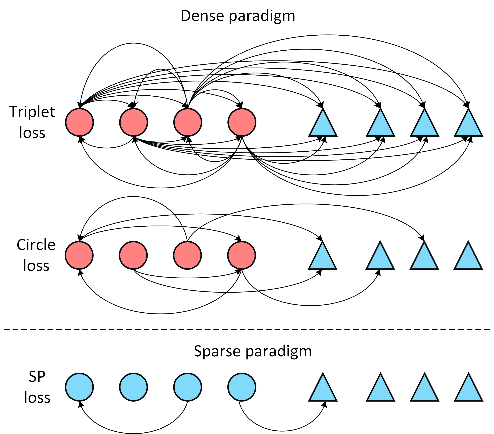
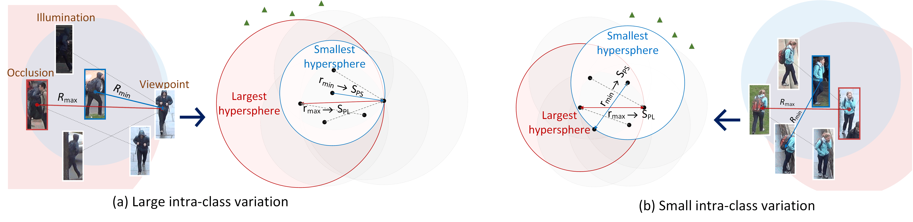

# Adaptive Sparse Pairwise Loss for Object Re-Identification (**CVPR 2023**)  
[Paper]
<!-- (https://arxiv.org/abs/2108.07755)  -->
<!-- &nbsp; &nbsp;  -->


## Introduction

Object re-identification (ReID) aims to find instances with the same identity as the given probe from a large gallery. 
Pairwise losses play an important role in training a strong ReID network.
Existing pairwise losses densely exploit each instance as an anchor and sample its triplets in a mini-batch. 
This dense sampling mechanism inevitably introduces positive pairs that share few visual similarities, which can be harmful to the training.
To address this problem, we propose a novel loss paradigm termed Sparse Pairwise (SP) loss that only leverages few appropriate pairs for each class in a mini-batch, 
and empirically demonstrate that it is sufficient for the ReID tasks. Based on the proposed loss framework, we propose an adaptive positive mining strategy that can dynamically adapt to diverse intra-class variations. Extensive experiments show that SP loss and its adaptive variant AdaSP loss outperform other pairwise losses, and achieve state-of-the-art performance across several ReID benchmarks.
### Method overview

<div align=center></div>

### Large vs. Small intra-class variations


## Prerequisites

- Please see [install.md](INSTALL.md) for installation.

## Train

```python
# assume that you are under the root directory of this project,
# and you have activated your virtual environment if needed.
# and with all ReID datasets you need in '/datasets/'.

# For example, ReID tasks using ID loss (cross entropy) and metric loss (AdaSP) on the DukeMTMC dataset
python tools/train_net.py --config-file configs/DukeMTMC/mgn_CE_adasp.yml MODEL.DEVICE "cuda:0" 

# For example, ReID tasks using only metric loss (AdaSP) on the DukeMTMC dataset
python tools/train_net.py --config-file configs/DukeMTMC/mgn_single_adasp.yml MODEL.DEVICE "cuda:0" 
```

## Results & Configs

Loss | MSMT17 (mAP) | Market-1501 (mAP) | DukeMTMC (mAP) | Veri-776 (mAP) | VehicleID-small (R1) | VehicleID-median (R1) | 
--- |:---:|:---:|:---:|:---:|:---:|:---:
SP-H  | 61.0 [config](configs/MSMT17/mgn_single_sp-h.yml)  | 80.5 [config](configs/Market1501/mgn_single_sp-h.yml) | 87.5 [config](configs/DukeMTMC/mgn_single_sp-h.yml) | 75.3 [config](configs/DukeMTMC/mgn_single_sp-h.yml) | 85.6 [config](configs/VeRi/norm_single_sp-h.yml)| 80.0 | 
SP-LH  | 58.4 [config](configs/MSMT17/mgn_single_sp-lh.yml)  | 77.0 [config](configs/Market1501/mgn_single_sp-lh.yml) | 83.8 [config](configs/DukeMTMC/mgn_single_sp-lh.yml) | 77.2 [config](configs/DukeMTMC/mgn_single_sp-lh.yml) | 87.0 [config](configs/VeRi/norm_single_sp-lh.yml)| 81.9 | 
AdaSP  | 60.7 [config](configs/MSMT17/mgn_single_adasp.yml)  | 80.1 [config](configs/Market1501/mgn_single_adasp.yml) | 86.8 [config](configs/DukeMTMC/mgn_single_adasp.yml) | 77.6 [config](configs/DukeMTMC/mgn_single_adasp.yml) | 86.4 [config](configs/VeRi/norm_single_adasp.yml)| 81.8 | 
 

## Acknowledgement

Thanks fastreid team for the wonderful open source project!


## Citation

If you find AdaSP useful in your research, please consider citing:

```
@inproceedings{
}
```
